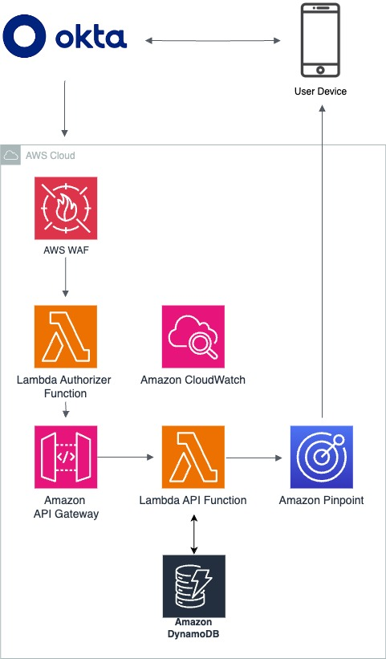
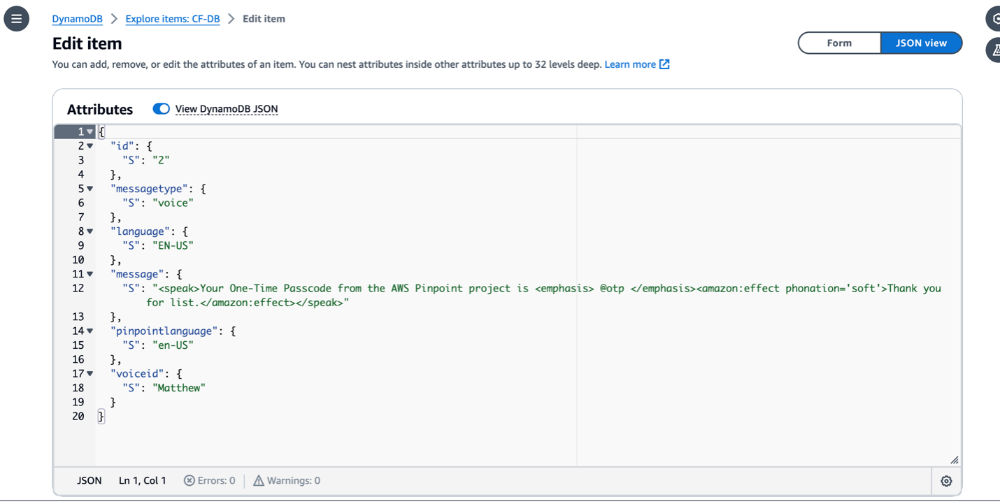
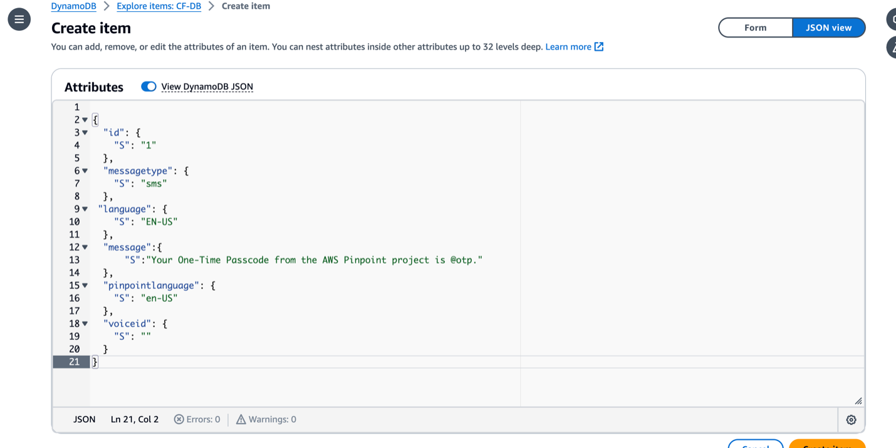
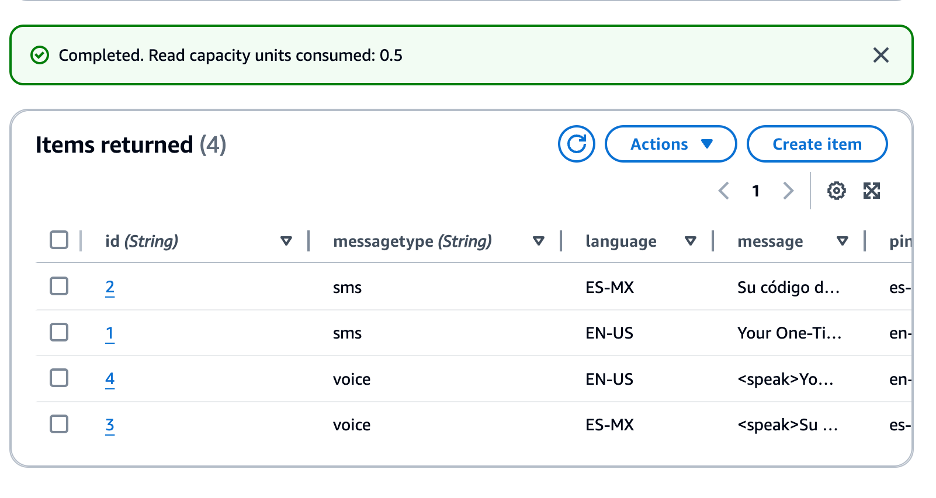
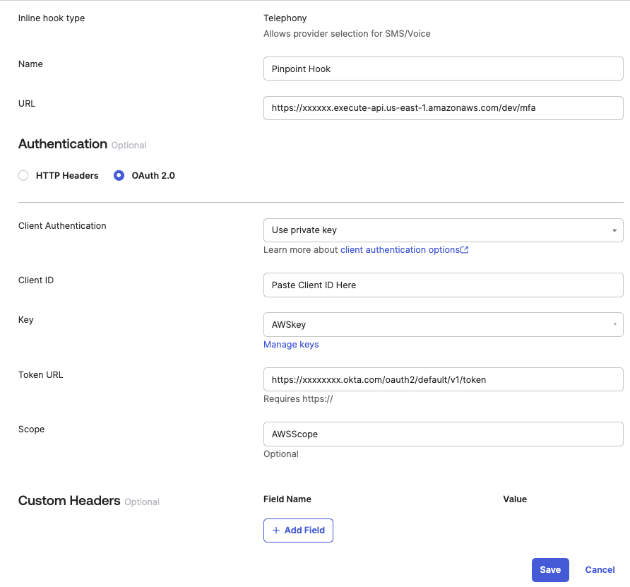
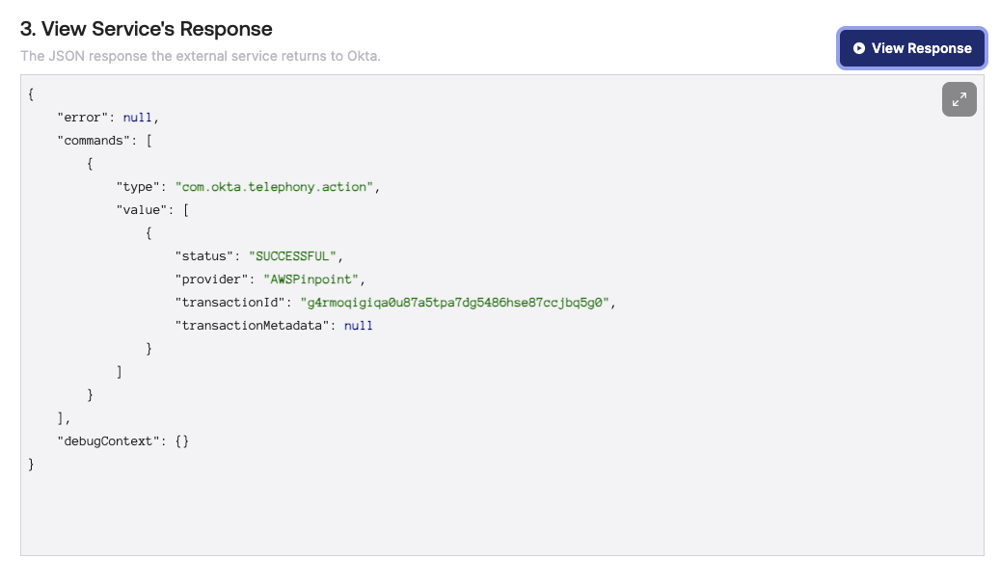

# Amazon Pinpoint and Okta Integration Guide

# Title

Integration of Amazon Pinpoint with Okta for Multi-factor Authentication (MFA) Utilizing Telephony Inline Hooks

# Introduction

This guide provides a detailed blueprint for integrating Amazon Pinpoint with Okta to effectively implement a multi-factor authentication (MFA) system using telephony inline hooks. This document is tailored for developers, system architects, and IT security professionals involved in deploying multi-factor authentication (MFA) solutions

The integration leverages Okta's telephony inline hooks with Amazon Web Services to manage SMS and voice call functionalities, which are essential for delivering one-time passcodes (OTPs). These OTPs are crucial for both authentication and account recovery processes. This guide will walk you through the setup involving AWS services such as AWS WAF, Amazon API Gateway, Amazon DynamoDB, AWS Lambda and Amazon Pinpoint, which together handle MFA requests via Okta's telephony inline hooks.

Additionally, this documentation highlights the capability to support multiple languages, for a diverse user base. The guide includes a step-by-step deployment section, where you will execute a CloudFormation teamplate that automatically provisions the necessary AWS resources to support these MFA functionalities.

# Solution Overview

The Okta telephony inline hook feature provides the capability to embed custom code within specific Okta workflows, particularly those that involve sending SMS or voice call messages for authentication. This hook can be seamlessly integrated into various Okta processes such as user enrollment, sign-in authentication, and account recovery when a phone number is used as an authenticator. The inline hook works by leveraging an external telephony service provider to dispatch a one-time passcode (OTP) to the individual requesting access. Upon sending the OTP, the service provider can communicate back to Okta with confirmation on whether the OTP delivery was executed successfully or not.

Note: Only one active telephony inline hook is allowed per organization.

**Detailed Workflow:**

  

1.	A user initiates sign-in on Okta and is prompted for phone-based authentication. The user chooses to receive the authentication code either via SMS or a voice call.
2.	Okta generates a one-time passcode (OTP) for the user and checks for an active telephony inline hook within the organization's configuration.
3.	Once verified, the telephony inline hook is activated, creating a request for OTP delivery from the external provider.
4. AWS WAF is used to protect the Amazon API Gateway endpoint by applying AWS managed rules to block malicious traffic and enhance security.
5. The request is first received by the Amazon API Gateway, which then invokes a Lambda Authorizer.
6. The Lambda Authorizer uses the @okta/jwt-verifier library to validate OAuth 2.0 JWT tokens from Okta, allowing or denying requests based on token integrity and authorization checks.
7. Upon successful authorization, the Amazon API Gateway invokes another Lambda Function to process the OTP request.
8.	Amazon DynamoDB is utilized to store message data specific to the user's language preference.
9.	If the requested language is identified in DynamoDB, the system sends the OTP delivery request to Amazon Pinpoint, the telephony provider.
10. The user then receives the OTP through their selected method — as an SMS text message or a voice call.
11. Okta is informed about the delivery status of the OTP via a response from the external service.
12. All related activities, including the validation process by AWS Lambda, the message delivery by Amazon Pinpoint, and the security events managed by AWS WAF, Amazon DynamoDB, are logged in AWS CloudWatch for monitoring and auditing purposes.

These steps provide a sequential flow of actions from the user's attempt to authenticate to the logging of the transaction, outlining the interaction between Okta, AWS services, and the end-user within the MFA process.

# Deployment Guide 

This section describes the steps required to deploy the Amazon Pinpoint and Okta integration for MFA, from initial setup to full operation.

# Pre-Deployment

Initially, your AWS account will be configured as a Sandbox account within Amazon Pinpoint. To move into a production environment and to increase your SMS and Voice Service spend limits, please follow the detailed steps outlined in the Amazon Pinpoint [User Guide Open Case](https://docs.aws.amazon.com/sms-voice/latest/userguide/sandbox.html#channels-voice-manage-sandbox). Transitioning to a production account will enable you to send messages without the sandbox restrictions.

Additionally, when preparing to send messages, you'll need to acquire a dedicated phone number. For specialized requirements like Short Codes, Toll-Free Numbers, or 10DLC Campaign Numbers, refer to the comprehensive instructions provided in the Amazon Pinpoint Phone Numbers [User Guide Phone Numbers](https://docs.aws.amazon.com/sms-voice/latest/userguide/phone-numbers.html). Keep in mind that carrier considerations such as message throughput, number pooling, carrier filtering policies, compliance with carrier regulations, and delivery rates are crucial factors that can influence your choice of number type and impact the delivery rates and success of your messaging campaigns. It's essential to understand the various throughput limitations, fees, and region-specific regulations associated with different carriers, as well as the need for sender ID registration in certain regions. By taking these carrier considerations into account, you can ensure that your messaging services are both effective and compliant with all relevant guidelines and regulations.

To acquire a long code for testing purposes, please adhere to the instructions in this guide. Ensure that you select 'Voice only' for the Messaging use case and choose 'Long code' as the originator type. This action will immediately allocate a phone number to your account, which will be restricted to voice call functionalities only. [Request Long Code](https://docs.aws.amazon.com/sms-voice/latest/userguide/phone-numbers-request.html). 

# Deployment Steps

## Deploying AWS Resources using AWS CloudFormation

To deploy the CloudFormation template from the AWS console, you can follow these steps:

1. **Access CloudFormation Service**:
   - Open the AWS Management Console and navigate to the CloudFormation service. You can search for "CloudFormation" in the search bar at the top of the console.

2. **Create Stack**:
   - Click on the orange "Create stack" button.

3. **Specify Template**:
   - Choose "Upload a template file" option.
   - Click "Browse" and select the CloudFormation template file `AmazonPinpointSetup.yml`.
   - Click "Next".

4. **Specify Stack Details**:
   - Enter a unique name for your CloudFormation stack (e.g., "pinpoint-lambda-api-stack").
   - Optionally, you can provide a description for your stack.
   - Click "Next".

5. **Configure Parameters**:
   - The console will display all the parameters defined in your template (PinpointAppName, FromPhoneNumber, etc.).
   - Provide values for each parameter according to your requirements. Refer to the parameter descriptions in the template for guidance.
   - Click "Next".

6. **Review and Create**:
   - Review the details of your stack creation, including resources, parameters, and outputs.
   - If everything looks good, check the box next to "I acknowledge that AWS CloudFormation might create AWS resources for you. Charges may apply."
   - Click the orange "Create stack" button to initiate the deployment.

7. **Monitor Stack Status**:
   - The CloudFormation console will display the status of your stack creation. It may take a few minutes to complete depending on the resources involved.
   - You can monitor the progress and view any potential errors that might occur during deployment.

8. **Outputs**:
   - Once the stack creation is successful, the "Outputs" section will display the generated values like Pinpoint application ID, Lambda function ARN, API Gateway Keys, and API Gateway invoke URL

**Additional Notes**:
- You can access the deployed resources (Pinpoint application, Lambda function, API Gateway, etc.) from their respective service dashboards in the AWS console.
- Consider reviewing AWS best practices for security and access control for your deployed resources.

By following these steps, you have accomplished the deployment of your CloudFormation template via the AWS Management Console. This process has established the foundation of your AWS Pinpoint project, which is now integrated with Lambda, API Gateway and AWS WAF for enhanced security.
 
## Upload Your Lambda API Trigger Function Code

To upload your Lambda Function code through the AWS Management Console, follow the sequence of steps provided. It is crucial to note that the `Lambda-API-Trigger-index.js` file within the folder is preset to operate in the 'us-east-1' AWS region. Should you intend to deploy your function in a different AWS region, you must modify the region configuration within the code. Specifically, you'll need to alter the variable `aws_region` found on line #3 of the `Lambda-API-Trigger-index.js` file to reflect your target region.

1. **Open the Lambda console** at [AWS Lambda Console](https://console.aws.amazon.com/lambda/).

2. In the **navigation pane** on the left side of the console, choose **Functions**.

3. In the list, **choose the Lambda API Function** created by CloudFormation.

4. Click on the **Code** tab.

5. You will see an `index.js` file with sample code. **Delete the sample code** in the `index.js` file.

6. Check the code shared on a separate file inside the `amazon-pinpoint-okta-integration-setup` Folder. The code is inside the `Lambda-API-Trigger-index.js` file.

7. **Copy and paste the code** present in file in your lambda function’s `index.js` file.

8. Click the **Deploy button**.

By completing these steps, you have successfully deployed your Lambda Function via the AWS Lambda Console. It is important to conduct a review of your code post-deployment. Additionally, ensure that you adjust the region variable within your code to match your targeted AWS region if it differs from the default 'us-east-1' region.

## Upload Your Lambda Authorizer Trigger Function Code

The AWS Lambda Authorizer Trigger Function is designed to secure your Amazon API gateway by leveraging OAuth 2.0 JWT tokens provided by Okta. Once deployed, this function acts as a gatekeeper, authenticating incoming requests to your Amazon API gateway endpoint. It verifies JWT tokens to ensure that they are valid and have been issued by the Okta domain. This setup is critical for maintaining secure access and preventing unauthorized use of your Amazon API gateway endpoint.

1. **Open the Lambda console** at [AWS Lambda Console](https://console.aws.amazon.com/lambda/).

2. In the **navigation pane** on the left side of the console, choose **Functions**.

3. In the list, **choose the Lambda Authorizer Function** created by CloudFormation.

4. Open a Mac/Linux/Windows terminal and navigate to the `amazon-pinpoint-okta-mfa/amazon-pinpoint-okta-integration-setup/Lambda-Authorizer` directory. 

   Example: `cd /Users/UserName/Desktop/amazon-pinpoint-okta-mfa/amazon-pinpoint-okta-integration-setup/Lambda-Authorizer`

5. Run the following terminal command to download the latest Okat JWT Verifier Module.

   Run command: `npm i @okta/jwt-verifier` (node must be installed to run)

6. Zip up the `node_module` folder + `index.js` file together located in `amazon-pinpoint-okta-mfa/amazon-pinpoint-okta-integration-setup/Lambda-Authorizer` folder.

7. Go back to the Lambda Console

8. Click on the **Code** tab.

9. Click on the **Upload From** drop down and select **.zip file** option

10. Upload the .zip file created in step 6.

11. Once .zip is uploaded, verify you see the `node_modules` folder and the `index.js` file inside the lambda directory.

12. Click on the **Configuration** tab

13. On the left pane click on **Environment variables** and click the **edit** button.

14. There will be a key variable named 'OKTA_ISSUER_URL'. You will edit the **Value** for that key and replace the $(yourOktaDomain) with your actual Okta Domain name. 'EX: https://mycompanyname/oauth2/default'

15. Click **Save**

By completing these steps, you have successfully deployed your Lambda Authorizer Function via the AWS Lambda Console. This setup is critical for securing access to your Amazon API gateway.

## Save Messages in DynamoDB

**Note**: For converting text to speech, Amazon Pinpoint integrates with Amazon Polly, which offers a variety of language options. In this example, we're focusing on English and Spanish language support. If your requirements include additional languages, please see the [Amazon Polly Voice List](https://aws.amazon.com/polly/docs/voicelist/) to determine the appropriate language codes and voice IDs. To incorporate these languages into your setup, reference the format provided in the 'English-Spanish-Data.txt' file, which outlines how messages are structured in DynamoDB. Then follow these steps to store language data into DynamoDB.

Use the following steps to enter data into a DynamoDB table via the DynamoDB console. DynamoDB serves as a repository for storing message content in different languages, which is then sent to users. This guide focuses on how to store message templates in both English and Spanish for SMS and voice communications.

1. **Open the DynamoDB console** at [AWS DynamoDB Console](https://console.aws.amazon.com/dynamodb/).

2. In the navigation pane on the left side of the console, choose **Tables**.

3. In the table list, **choose the table** created by CloudFormation.

4. Select **Explore Table Items**.

5. In the Items returned view, choose **Create item**.

6. **Add data in JSON view**.

7. **Paste Voice sample message** from the 'English-Spanish-Data.txt' file.

8. Click **Create Item**.

**Sample Voice message:**

9. **Repeat for required Voice Languages**.

10. **Paste SMS sample message** from the 'English+Spanish-DBData.txt' file.

11. Click **Create Item**.

**Sample SMS message:** 

12. **Repeat for required SMS Languages**.

**Database Entries:** 

Upon completing these steps, your DynamoDB table will be ready to store and manage your language message data, effectively supporting both English and Spanish communications.

## Create Inline Hook in Okta

This section provides a detailed guide on setting up and testing an OAuth 2.0 Telephony Inline Hook with Okta. You will configure your Okta environment, including creating a private key, setting up an app integration, and defining a custom scope. Once set up, you will add OAuth 2.0 authentication fields to ensure secure interactions with the Amazon API Gateway for SMS and voice communications.

### Setup Steps

1. **Create a Key:**
   - Navigate to the **Admin Console** and go to **Workflow > Key Management**.
   - Click **Create new key** and add a unique name for the key. You will reference this name when adding your Inline Hook.
   - Click **Create key**. The key is added to the table with a creation date and status.
   - In the table, click your key name.
   - Click **Copy public key**. You will need this public key in the next steps.

2. **Create an App Integration:**
   - In the Admin Console, go to **Applications > Applications**.
   - Click **Create App Integration**.
   - Select **API Services** as the Sign-in method and click **Next**.
   - Specify the app integration name, then click **Save**.
   - From the **General** tab of your app integration, click **Edit** next to **Client Credentials**.
   - In the **Client authentication** field, select **Public key / Private key**.
   - In the **Public Keys** section, click **Add key**.
   - Paste the public key that you copied earlier, and click **Done**.
   - Scroll to **General Settings** and click **Edit**
   - Uncheck the box for **Proof of possession**
   - Click **Save** 
   - Scroll to the top and copy the generated **Client ID** value.

3. **Add a Custom Scope:**
   - Go to **Security > API**.
   - On the **Authorization Servers** tab, select the name of the authorization server, then select **Scopes**.
   - Click **Add Scope**.
   - Enter a **Name** and **Description** for the scope. You will need the name of the scope when configuring your Inline Hook.
   - Select the checkbox **Include in public metadata**.
   - Click **Create**.

4. **Add Inline Hook with OAuth 2.0 Authentication Fields**
   - In the Admin Console, go to **Workflow > Inline Hooks**.
   - Click **Add Inline Hook** and select **Telephony**
   - Add a name for the Hook
   - Add the Amazon API Gateway URL, including the endpoint where the API is hosted (e.g., https://xxxxxxxx.execute-api.us-east-1.amazonaws.com/dev/mfa).
   - When creating your Inline Hook, in the **Authentication** section, select **OAuth 2.0**.
   - In the **Client Authentication** field, select **Use private key** from the dropdown menu.
   - Add the **Client ID** value from your app integration.
   - Select the **Key** that you created previously from the dropdown menu.
   - Add the authorization server's token URL, such as `https://${yourOktaDomain}/oauth2/default/v1/token`, and the custom scope that you created previously.
   - Click **Save**.

   **Inline Hook Configuration:**

  

### Testing the Telephony Inline Hook

1. Return to the **Workflow > Inline Hooks** page and click on your Inline Hook.

2. Navigate to the **Preview** tab.

3. **Configure Test**:
   - For user profile, select a user.
   - For requestType, select **MFA Verification**.

4. **Generate and Edit Request**:
   - Click on **Generate Request**.
   - Click on **Edit**.
   - Edit `phoneNumber` with your destination phone number.
   - Change `deliveryChannel` to `VOICE` instead of SMS.
   - **Note:** For this test, the long code associated with the Amazon Pinpoint account supports only voice communications. If your assigned long code or short code supports SMS, you can configure it to use SMS as needed.

5. **Submit Request**: Click `Save` and then on the `View Response` button.

   **Okta Successful Response:** 

  

6. **Verify Response**:
   - Your destination number should receive a phone call if successful.
   - The response will be displayed in JSON format under the `View Response` section.

By following these comprehensive steps, you ensure that your Inline Hook is properly configured for secure and efficient communication between Okta and your Amazon API Gateway.

### Update an Authentication Policy

This section outlines the process of updating a preset authentication policy by adding a new rule, specifically to apply the Multi-Factor Authentication (MFA) capabilities used to securely log into the Okta console. These MFA capabilities are not only limited to the Okta console but can also be applied to other MFA use cases where SMS or voice-based MFA is needed to log into various Okta-integrated applications such as AWS, Salesforce, and more.

#### Steps to Create a Group and Add a User

1. **Navigate to Groups**:
   - In the Okta Admin Console, go to **Directory > Groups**.
2. **Create a Group**:
   - Click `Add Group`.
   - Name the group "Support" and then click `Save`.
3. **Assign Users to Group**:
   - Select the group you created.
   - Go to the **People** tab and click `Assign People`.
   - Add a user to the group for testing, ensuring the user has a usable phone number included in their profile.
   - Click `Save`.

### Add a Rule to the Policy

Once your test group and user are set up, proceed to update the Okta Dashboard's preset authentication policy by adding a rule that includes an additional factor for the "Support" group.

1. **Navigate to Authentication Policies**:
   - In the Admin Console, go to **Security > Authentication Policies**.
   - Select the **Okta Dashboard preset policy**.
2. **Add a New Rule**:
   - Click `Add Rule` and name the rule.
3. **Configure Group Membership**:
   - In the "AND User's group membership includes" dropdown, select `At least one of the following groups`.
   - Start typing the name of the group you created ("Support") and select it when it appears.
4. **Adjust Factor Constraints**:
   - In the "AND Possession factor constraints are" section, clear the `Device Bound (excludes phone and email)` checkbox.
5. **Verify Factor Type**:
   - Ensure that "Phone" is listed as an additional factor type in the "AND Access with Okta FastPass is granted" section.
6. **Save the Configuration**:
   - Click `Save` to apply the new rule to the policy.

By following these steps, you will have successfully updated the authentication policy to include additional security measures for users in the "Support" group.

## CloudWatch Logs for Lambda Function, AWS Pinpoint, and AWS WAF

Amazon CloudWatch plays a crucial role in monitoring AWS services like AWS Lambda, Amazon Pinpoint, and AWS WAF by capturing and storing logs. It processes this data into readable, actionable insights. This ensures that you can effectively track and analyze the behavior and performance of your services.

### Monitoring AWS Lambda Logs

- **Log Storage**: All console logs from the AWS Lambda function are stored in CloudWatch logs.
- **API Logging**: You can enable API Gateway logging at the API level to capture detailed interaction data.

### Monitoring Amazon Pinpoint Metrics

- **Metric Collection**: CloudWatch collects raw data on Amazon Pinpoint SMS and Voice communications and processes it into readable, near real-time metrics.
- **Alarms and Notifications**: Set alarms in CloudWatch to monitor specific thresholds for SMS and Voice metrics. When these thresholds are crossed, CloudWatch can trigger notifications or automatic responses.

### Monitoring AWS WAF Logs

- **Log Storage**: All AWS WAF logs, including the details of blocked and allowed requests, are stored in CloudWatch logs.
- **Security Event Logging**: AWS WAF logs provide detailed information about security events, helping you to identify and respond to malicious traffic.

### Key Metrics to Watch

- **TextMessageMonthlySpend**: Tracks the monthly expenditure (in US Dollars) on SMS messages. Recommended to monitor at the 'Maximum' statistic level.
- **VoiceMessageMonthlySpend**: Tracks the monthly expenditure (in US Dollars) on voice messages. Similarly, this should be monitored at the 'Maximum' statistic level.
- **WAFAllowedRequests**: Tracks the number of requests that AWS WAF allowed.
- **WAFBlockedRequests**: Tracks the number of requests that AWS WAF blocked.

For detailed guidance on configuring and utilizing these metrics, refer to the [Amazon CloudWatch User Guide](https://docs.aws.amazon.com/AmazonCloudWatch/latest/monitoring/).

By integrating CloudWatch into your AWS services monitoring strategy, you can maintain  oversight over your applications' performance and spending.

# Clean Up

To avoid incurring unnecessary charges, it is crucial to clean up the resources you've deployed after they are no longer needed. Follow these steps to properly remove the resources and ensure that your AWS account and Okta configuration do not continue to be charged or compromised:

1. **Delete AWS CloudFormation Stacks**: Navigate to the AWS CloudFormation console and delete the stacks you have deployed. This action removes all resources associated with those stacks, including AWS Lambda functions, Amazon API Gateways, Amazon DynamoDB tables, and any other related services.

2. **Revoke Okta Inline Hooks and API Tokens**: In the Okta Admin Console, remove any Inline Hooks you have set up and delete any API tokens or sessions created for this integration to ensure that no unwanted operations remain active.

3. **Remove Users and Groups in Okta**: 
   - Go to **Directory > Groups** in the Okta Admin Console.
   - Find and delete the groups you created specifically for testing or this deployment. Make sure to remove all users from these groups before deletion.
   - Navigate to **Directory > People**, find the users added for testing, and deactivate or delete their accounts.
4. **Revert or Delete Custom Authentication Policies**:
   - Go to **Security > Authentication Policies**.
   - Remove any custom rules or policies that were specifically added for this deployment. If a policy was modified, revert it to its original settings.
   - Ensure that no residual configurations that could affect other operational areas remain.

By following these clean-up steps, you ensure that all temporary configurations and resources are properly decommissioned.

# Conclusion

This guide provided detailed instructions on integrating Amazon Pinpoint with Okta for SMS/Voice multi-factor authentication using AWS services. Through the deployment of AWS CloudFormation and detailed configuration of Okta Inline Hooks, we have established a solution for managing SMS and voice communications for MFA, with enhanced security provided by AWS WAF.